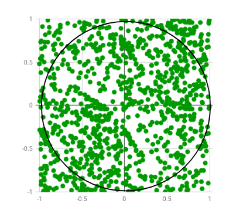

# Computing the value of Pi

### 题目表述

    Write a program that computes the value of Pi with a precision of two decimal digits.

    编写一个程序，以两位十进制数字的精度计算Pi值。

### 解决方案

    A suitable solution for approximately determining the value of Pi is using a Monte Carlo simulation. This is a method that uses random samples of inputs to explore the behavior of complex processes or systems. The method is used in a large variety of applications and domains, including physics, engineering, computing, finance, business, and others.

    To do this we will rely on the following idea: the area of a circle with diameter d is $PI * d^2 / 4$.The area of a square that has the length of its sides equal to d is $d^2$ If we divide the two we get $PI/4$. If we put the circle inside the square and generate random numbers uniformly distributed within the square, then the count of numbers in the circle should be directly proportional to the circle area, and the count of numbers inside the square should be directly proportional to the square’s area. That means that dividing the total number of hits in the square and circle should give $PI/4$. The more points generated, the more accurate the result shall be.

    For generating pseudo-random numbers we will use a Mersenne twister and a uniform statistical distribution:

    近似确定Pi值的合适解决方案是使用蒙特卡罗模拟。这是一种使用输入的随机样本来探索复杂过程或系统行为的方法。该方法被广泛应用于物理、工程、计算、金融、商业等领域。  
    要做到这一点，我们将依赖以下想法：直径为d的圆的面积是$PI*d^2/4$。边长等于d的正方形的面积是$d^2$，如果我们将二者分开，我们得到$PI/4$。如果我们把圆放在正方形内，并生成均匀分布在正方形内的随机数，那么圆圈内的数字计数应与圆圈面积成正比，正方形内的数字计数应与正方形面积成正比。这意味着，将方块和圆圈中的点击总数除以$PI/4$。生成的点越多，结果越准确。

    为了生成伪随机数，我们将使用梅森扭曲器和统一的统计分布：

```cpp
///////////////////////////////////////////////////////////////////////////////////////////
// Copyright (c) 2021, Tom Zhao personal. ("UsingSTLEx")
// This software is a personal tools project by Tom Zhao.
// Description:
///////////////////////////////////////////////////////////////////////////////////////////

#include <array>
#include <iostream>
#include <random>

using std::cout;
using std::endl;

template <typename E = std::mt19937,
          typename D = std::uniform_real_distribution<>>
double compute_pi(E& engine, D& dist, int const samples = 1000000) {
  auto hit = 0;
  for (auto i = 0; i < samples; ++i) {
    auto x = dist(engine);
    auto y = dist(engine);
    if (y <= std::sqrt(1 - std::pow(x, 2))) hit += 1;
  }
  return 4.0 * hit / samples;
}

int main() {
  std::random_device rd;
  auto seed_data = std::array<int, std::mt19937::state_size>{};
  std::generate(std::begin(seed_data), std::end(seed_data), std::ref(rd));
  std::seed_seq seq(std::begin(seed_data), std::end(seed_data));
  auto eng = std::mt19937{seq};
  auto dist = std::uniform_real_distribution<>{0, 1};

  for (auto j = 0; j < 10; ++j) {
    cout << compute_pi(eng, dist) << endl;
  }
  return 0;
}

```

### 延伸题目 —— Estimating the value of Pi using Monte Carlo

[Estimating the value of PI using Monte Carlo](https://www.geeksforgeeks.org/estimating-value-pi-using-monte-carlo/?ref=gcse "Estimating the value of PI using Monte Carlo")

**Monte Carlo estimation**  
[    Monte Carlo methods](https://en.wikipedia.org/wiki/Monte_Carlo_method) are a broad class of computational algorithms that rely on repeated random sampling to obtain numerical results. One of the basic examples of getting started with the [Monte Carlo algorithm](https://en.wikipedia.org/wiki/Monte_Carlo_algorithm) is the [estimation of Pi](http://www.eveandersson.com/pi/monte-carlo-circle).  
**Estimation of Pi**  
    The idea is to simulate random (x, y) points in a 2-D plane with domain as a square of side 1 unit. Imagine a circle inside the same domain with same diameter and inscribed into the square. We then calculate the ratio of number points that lied inside the circle and total number of generated points. Refer to the image below:



Random points are generated only few of which lie outside the imaginary circle

**蒙特卡罗估计**  
[蒙特卡罗方法](https://en.wikipedia.org/wiki/Monte_Carlo_method)是一类广泛的计算算法，依靠重复随机抽样来获得数值结果。开始使用[Monte Carlo算法]的基本示例之一(https://en.wikipedia.org/wiki/Monte_Carlo_algorithm)是[Pi的估计](http://www.eveandersson.com/pi/monte-carlo-circle).  
**Pi的估计**  
其思想是在二维平面上模拟随机（x，y）点，域为1边单位的平方。想象一下，在同一个区域内有一个直径相同的圆，并刻在正方形上。然后，我们计算位于圆内的点数与生成的点数之比。请参阅下图：


生成的随机点中只有少数位于假想圆之外

 **Examples:**

```cpp
INTERVAL = 5
Output : Final Estimation of Pi = 2.56

INTERVAL = 10
Output : Final Estimation of Pi = 3.24

INTERVAL = 100
Output : Final Estimation of Pi = 3.0916
```

```cpp
///////////////////////////////////////////////////////////////////////////////////////////
// Copyright (c) 2021, Tom Zhao personal. ("UsingSTLEx")
// This software is a personal tools project by Tom Zhao.
// Description:
///////////////////////////////////////////////////////////////////////////////////////////

#include <array>
#include <iostream>
#include <random>

using std::cout;
using std::endl;

// Defines precision for x and y values. More the
// interval, more the number of significant digits
#define INTERVAL 10000
using namespace std;

int main() {
  int interval, i;
  double rand_x, rand_y, origin_dist, pi;
  int circle_points = 0, square_points = 0;

  // Initializing rand()
  srand(time(NULL));

  // Total Random numbers generated = possible x
  // values * possible y values
  for (i = 0; i < (INTERVAL * INTERVAL); i++) {
    // Randomly generated x and y values
    rand_x = double(rand() % (INTERVAL + 1)) / INTERVAL;
    rand_y = double(rand() % (INTERVAL + 1)) / INTERVAL;

    // Distance between (x, y) from the origin
    origin_dist = rand_x * rand_x + rand_y * rand_y;

    // Checking if (x, y) lies inside the define
    // circle with R=1
    if (origin_dist <= 1) circle_points++;

    // Total number of points generated
    square_points++;

    // estimated pi after this iteration
    pi = double(4 * circle_points) / square_points;

    // For visual understanding (Optional)
    cout << rand_x << " " << rand_y << " " << circle_points << " "
         << square_points << " - " << pi << endl
         << endl;

    // Pausing estimation for first 10 values (Optional)
    if (i < 20) getchar();
  }

  // Final Estimated Value
  cout << "\nFinal Estimation of Pi = " << pi;

  return 0;
}

```

### 延伸题目 —— Estimating the value of Pi using Monte Carlo | Parallel Computing Method

​[Estimating the value of Pi using Monte Carlo | Parallel Computing Method](https://www.geeksforgeeks.org/estimating-the-value-of-pi-using-monte-carlo-parallel-computing-method/?ref=gcse "Estimating the value of Pi using Monte Carlo | Parallel Computing Method")

    Given two integers N and K representing number of trials and number of total threads in parallel processing. The task is to find the [estimated value of PI using the Monte Carlo algorithm](https://www.geeksforgeeks.org/estimating-value-pi-using-monte-carlo/) using the [Open Multi-processing (OpenMP)](https://www.geeksforgeeks.org/openmp-introduction-with-installation-guide/) technique of parallelizing sections of the program.

 **Examples:**

    给定两个整数N和K，表示并行处理中的试验数和总线程数。任务是找到[使用蒙特卡罗算法估算的PI值](https://www.geeksforgeeks.org/estimating-value-pi-using-monte-carlo/)使用[开放式多处理（OpenMP）](https://www.geeksforgeeks.org/openmp-introduction-with-installation-guide/)并行化程序各部分的技术。  
 **例如：**

```cpp
Input: N = 100000, K = 8 
Output: Final Estimation of Pi = 3.146600

Input: N = 10, K = 8
Output: Final Estimation of Pi = 3.24

Input: N = 100, K = 8
Output: Final Estimation of Pi = 3.0916
```

    Approach: The above given problem [Estimating the value of Pi using Monte Carlo](https://www.geeksforgeeks.org/estimating-value-pi-using-monte-carlo/) is already been solved using standard algorithm. Here the idea is to use parallel computing using [OpenMp](https://www.geeksforgeeks.org/openmp-introduction-with-installation-guide/) to solve the problem. Follow the steps below to solve the problem:

* Initialize 3 variables say  **x, y** , and **d** to store the **X** and **Y** co-ordinates of a random point and the square of the distance of the random point from origin.
* Initialize 2 variables say **pCircle** and **pSquare** with values **0** to store the points lying inside circle of radius **0.5** and square of side length  **1** .
* Now starts the parallel[ processing with OpenMp](https://www.geeksforgeeks.org/openmp-introduction-with-installation-guide/) together with[ reduction()](https://www.openmp.org/spec-html/5.0/openmpsu107.html) of the following section:

  * Iterate over the range **[0, N] and find **x** and **y** in each iteration using **srand48()** and **drand48()** then find the square of distance of point (**x, y)** from origin and then if the distance is less than or equal to **1** then increment **pCircle** by **1** .
  * In each iteration of the above step, increment the count of **pSquare** by **1** .
* Finally, after the above step calculate the value of estimated pi as below and then print the obtained value.

  * ** Pi = 4.0 * ((double)pCircle / (double)(pSquare))**

    Below is the implementation of the above approach:

```cpp
// C++ program for the above approach
#include <iostream>
using namespace std;

// Function to find estimated
// value of PI using Monte
// Carlo algorithm
void monteCarlo(int N, int K)
{
	// Stores X and Y coordinates
	// of a random point
	double x, y;

	// Stores distance of a random
	// point from origin
	double d;
	// Stores number of points
	// lying inside circle
	int pCircle = 0;

	// Stores number of points
	// lying inside square
	int pSquare = 0;
	int i = 0;

// Parallel calculation of random
// points lying inside a circle
#pragma omp parallel firstprivate(x, y, d, i) reduction(+ : pCircle, pSquare) num_threads(K)
	{
		// Initializes random points
		// with a seed
		srand48((int)time(NULL));
		for (i = 0; i < N; i++)
		{
			// Finds random X co-ordinate
			x = (double)drand48();
			// Finds random X co-ordinate
			y = (double)drand48();
			// Finds the square of distance
			// of point (x, y) from origin
			d = ((x * x) + (y * y));
			// If d is less than or
			// equal to 1
			if (d <= 1)
			{
				// Increment pCircle by 1
				pCircle++;
			}
			// Increment pSquare by 1
			pSquare++;
		}
	}
	// Stores the estimated value of PI
	double pi = 4.0 * ((double)pCircle / (double)(pSquare));
	// Prints the value in pi
	cout << "Final Estimation of Pi = "<< pi;
}

// Driver Code
int main()
{
	// Input
	int N = 100000;
	int K = 8;

	// Function call
	monteCarlo(N, K);
}

// This code is contributed by shivanisinghss2110

```
